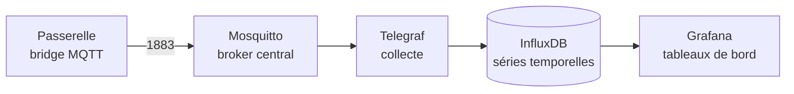

# Déployer la chaîne de supervision

**15 minutes.** Quatre services conteneurisés sur votre laptop.

## Ce que vous déployez



Chaque brique a un rôle unique. **Mosquitto** reçoit les messages remontés par
la passerelle. **Telegraf** les transforme en points de mesure. **InfluxDB**
les stocke dans le temps. **Grafana** les affiche.

Cette séparation est la norme en supervision : un transport, un collecteur, un
stockage, une visualisation. Chaque étage se remplace indépendamment.

## Lancer la pile

Placez le dossier dans un chemin court, sans accent ni espace — sur Windows,
directement dans votre profil utilisateur.

```bash
cd iot-s9/laptop
docker compose up -d
docker compose ps
```

Les quatre conteneurs doivent afficher `running`. Un service en `restarting`
signale un fichier de configuration mal monté :

```bash
docker compose logs mosquitto
docker compose logs telegraf
```

:::note
Telegraf émet quelques erreurs pendant les trente premières secondes : il tente
de joindre InfluxDB avant la fin de son initialisation, et réessaie tout seul.
Ne vous en inquiétez qu'au-delà d'une minute.
:::

## Accéder aux interfaces

| Service | Adresse | Identifiants |
|---|---|---|
| Grafana | http://localhost:3000 | `admin` / voir l'énoncé |
| InfluxDB | http://localhost:8086 | `admin` / voir l'énoncé |

Ouvrez Grafana et vérifiez que la source de données InfluxDB est déclarée :
menu **Connections → Data sources**. Elle est provisionnée automatiquement au
démarrage, vous n'avez rien à saisir.

## Observer le trafic brut

Avant de construire des tableaux de bord, regardez ce qui arrive réellement sur
le broker. C'est le réflexe à acquérir : en supervision, on commence toujours
par écouter avant d'agréger.

```bash
docker exec -it ilot-mosquitto mosquitto_sub -t '#' -v
```

Le motif `#` capte tous les topics. Laissez tourner : dans les secondes qui
suivent, un message doit apparaître spontanément.

:::tip[Vérification]
Vous voyez au moins une ligne du type :

```text
ilot3/st/bridge/ilot3 1
```

Ce message n'est pas venu d'un device. C'est la passerelle qui annonce l'état
de sa liaison vers vous. Sa présence prouve que le bridge est établi, dans le
bon sens, et que votre pare-feu laisse passer le port 1883.

Si rien n'apparaît : voir
[Pièges connus](./pieges#aucun-message-narrive-sur-le-broker).
:::

Gardez cet abonnement ouvert dans un terminal pendant toute la suite du
chantier — il vous servira de témoin permanent.

:::info[Objectif bonus]
Ce même message apparaît sous deux formes différentes. Trouvez-les et expliquez
la différence. La réponse est dans le mécanisme du bridge, pas dans un
dysfonctionnement.
:::
