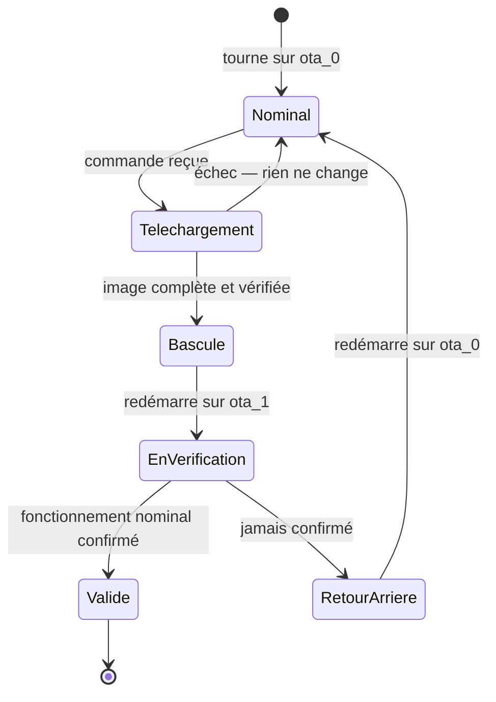

# Deux emplacements, un aiguillage

**30 minutes, sans toucher au matériel.** Cette étape est conceptuelle, et
elle conditionne tout le reste.

## Pourquoi doubler la mémoire

Votre carte a 8 Mo de flash. La table de partitions en réserve **deux blocs de
3 Mo** pour une seule application :

```text
ota_0    app   0x020000   3 Mo
ota_1    app   0x320000   3 Mo
otadata  data  0x00F000   8 Ko
```

Le firmware tourne sur l'un, la mise à jour s'écrit dans l'autre, et `otadata`
retient lequel démarrer.

Répondez avant de continuer : **que se passerait-il avec un seul emplacement ?**
Déroulez le scénario d'une coupure de courant à 60 % de l'écriture. Que
contient la mémoire ? Que fait la carte au redémarrage ?

C'est la réponse à cette question qui justifie de sacrifier 3 Mo.

## Le cycle complet



L'état **en vérification** est le cœur du dispositif. Une image fraîchement
installée n'est pas considérée comme bonne : elle est en sursis. Elle doit
**se déclarer valide elle-même**, et si elle n'y parvient pas, le chargeur
d'amorçage revient à la précédente au redémarrage suivant.

## Lire le code

Ouvrez `main/ilot_ota.c` et `main/main.c`, et repérez :

**Où l'image se déclare valide.** Cherchez `esp_ota_mark_app_valid_cancel_rollback()`.
À quel moment de `app_main()` est-elle appelée ?

**Pourquoi pas plus tôt.** Imaginez qu'elle soit appelée à la première ligne de
`app_main()`. Qu'est-ce que le mécanisme garantirait encore ? C'est l'erreur la
plus répandue dans les exemples qu'on trouve en ligne.

**Quelle condition est exigée.** Lisez `attendre_fonctionnement_nominal()`.
Combien de temps, et de quoi exactement ?

:::tip[Vérification]
Vous savez répondre à ces trois questions sans relire le code, et vous pouvez
expliquer en une phrase pourquoi un seul emplacement rendrait le retour arrière
impossible.
:::

## L'option qui change tout

Dans `sdkconfig.defaults` :

```text
CONFIG_BOOTLOADER_APP_ROLLBACK_ENABLE=y
```

Sans elle, une image fraîchement installée est considérée valide dès son
premier démarrage, et le chargeur d'amorçage ne reviendra **jamais** en arrière.
Tout le reste du chantier serait sans effet.

:::info[Objectif bonus]
`CONFIG_BOOTLOADER_APP_ANTI_ROLLBACK` existe aussi, et fait presque l'inverse :
il interdit d'installer une version antérieure. Dans quel cas voudrait-on ça ?
Et quel risque d'exploitation cette protection introduit-elle ?
:::
