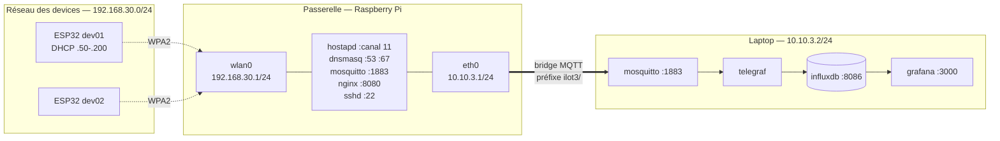

# Corrigé — Chantier 0, étape 3

Réponses attendues aux questions de la page
[Cartographier la passerelle](/chantiers/chantier-0/passerelle), avec les
erreurs fréquentes et ce qui vaut les points.

Les valeurs données correspondent à l'**îlot 3**. Transposer : `N` numéro
d'îlot, réseau Wi-Fi `192.168.N0.0/24`, lien laptop `10.10.N.0/24`, canal 1
pour les îlots 1 et 4, 6 pour les îlots 2 et 5, 11 pour l'îlot 3.

## Le schéma attendu



Un schéma est accepté s'il permet à quelqu'un n'ayant jamais vu l'îlot
d'intervenir. Concrètement : les deux interfaces avec leurs adresses, les
services avec leurs ports, et le sens de circulation des messages. Le reste
est du confort.

## 1. Interfaces et adresses

**Deux interfaces actives**, plus la boucle locale.

| Interface | Adresse | Rôle |
|---|---|---|
| `wlan0` | 192.168.30.1/24 | point d'accès des devices |
| `eth0` | 10.10.3.1/24 | lien vers le laptop |
| `lo` | 127.0.0.1/8 | boucle locale |

**Aucune route par défaut.** `ip route` ne retourne que les deux routes de
réseau directement connecté. C'est le point que l'on attend qu'ils relèvent :
la passerelle ne peut joindre ni Internet, ni le réseau de l'école. Elle ne
peut parler qu'aux devices et au laptop.

:::note[Erreur fréquente]
Beaucoup écrivent « la passerelle route entre le Wi-Fi et l'Ethernet ». C'est
faux : `ip_forward` n'est pas activé et aucune route ne l'exige. Les devices
**ne peuvent pas** joindre le laptop directement. Seul mosquitto fait le lien,
au niveau applicatif, via son bridge. C'est une distinction importante et elle
vaut des points.
:::

## 2. Services

Quatre services applicatifs, plus `sshd`.

| Service | Rôle |
|---|---|
| `hostapd` | point d'accès Wi-Fi : balises, authentification, association |
| `dnsmasq` | serveur DHCP des devices, et résolution de `broker.ilot` |
| `mosquitto` | broker MQTT de périphérie, et bridge vers le laptop |
| `nginx` | serveur HTTP des binaires firmware |

Réponse acceptable si les quatre rôles sont identifiés, même approximativement.
On ne demande pas de savoir ce qu'est hostapd avant de l'avoir cherché.

## 3. Ports en écoute

```text
tcp   LISTEN  0.0.0.0:22        sshd
tcp   LISTEN  0.0.0.0:1883      mosquitto
tcp   LISTEN  0.0.0.0:8080      nginx
tcp   LISTEN  192.168.30.1:53   dnsmasq
```

**Le piège est volontaire.** `ss -tlnp` ne montre que le TCP. Le serveur DHCP
écoute en **UDP sur le port 67** et n'apparaît pas. Un binôme qui repère
l'absence et lance `ss -ulnp` de lui-même a compris quelque chose d'important
sur l'outil — à valoriser explicitement.

**La différence d'adresse d'écoute est l'autre point clé.** `mosquitto` et
`nginx` écoutent sur `0.0.0.0`, donc sur **toutes** les interfaces : un device
en 192.168.30.x comme le laptop en 10.10.3.2 peuvent les joindre. `dnsmasq`
est lié à `wlan0` uniquement, par la directive `bind-interfaces` : le laptop
ne peut pas lui demander d'adresse, et c'est voulu.

Question de relance si un binôme va vite : *que se passerait-il si dnsmasq
écoutait aussi sur eth0 ?* Réponse : il distribuerait des adresses sur le lien
laptop, entrant en conflit avec l'adressage statique.

## 4. Configuration Wi-Fi

Extraits attendus de `hostapd.conf` :

| Paramètre | Valeur | Signification |
|---|---|---|
| `channel` | 11 | canal 2,4 GHz |
| `hw_mode=g` + `ieee80211n=1` | — | 802.11n en 2,4 GHz |
| `wpa=2` / `rsn_pairwise=CCMP` | — | WPA2 seul, chiffrement AES |
| `ieee80211w=0` | — | PMF désactivé |
| puissance | 10 dBm | bridée |

**Pourquoi une puissance si basse.** C'est la question qui discrimine. La
bande 2,4 GHz ne compte que **trois canaux sans recouvrement** — 1, 6 et 11 —
pour cinq îlots. Deux îlots partagent donc forcément un canal. Réduire la
puissance réduit la taille de chaque cellule : on couvre une table, pas la
salle, ce qui limite la contention de temps d'antenne entre îlots voisins.

Réponse partielle acceptable : « pour que les îlots ne se gênent pas ».
Réponse complète : mentionne les trois canaux disponibles pour cinq îlots.

Réponse à écarter : « pour économiser la batterie » ou « pour la sécurité ».
Le Pi est sur secteur, et 10 dBm reste largement audible depuis le couloir.

**Sur `ieee80211w=0`** : le PMF est désactivé parce que le module Wi-Fi
Inventek des cartes ST ne le supporte pas. Ce n'est pas dans l'énoncé, ils ne
peuvent pas le deviner — ne rien exiger là-dessus, mais c'est une bonne
anecdote à raconter en correction : la compatibilité du parc dicte le niveau
de sécurité atteignable, et c'est un arbitrage d'exploitation typique.

## 5. Attribution des adresses

| Paramètre | Valeur |
|---|---|
| Plage | 192.168.30.50 → 192.168.30.200 |
| Durée de bail | 12 heures |
| Passerelle annoncée | 192.168.30.1 |
| DNS annoncé | 192.168.30.1 |

Environ 150 adresses pour 4 devices : largement dimensionné, et c'est normal.

Question de relance : *pourquoi la plage ne commence-t-elle pas à .2 ?* Les
adresses basses sont réservées aux affectations statiques — ce dont ils auront
besoin quand un device devra garder la même adresse d'une séance à l'autre.

`dnsmasq.leases` est vide à ce stade. Ils le reverront rempli au chantier
suivant, et c'est le premier fichier à consulter quand un device ne répond
plus.

## 6. Le bridge — la question centrale

Configuration :

```text
connection ilot3-central
address 10.10.3.2:1883

topic tel/# out 0 "" ilot3/
topic evt/# out 0 "" ilot3/
topic st/#  out 0 "" ilot3/
topic cmd/# in  0 "" ilot3/
```

**Vers quelle adresse, et pourquoi celle-là.** `10.10.3.2`, c'est-à-dire le
laptop de leur îlot, sur le lien Ethernet direct. Pas le Wi-Fi, pas Internet.
C'est la seule machine que la passerelle peut joindre en dehors des devices.

**Sens de circulation.** Montent : télémétrie, événements, états. Descend :
les commandes. Ce n'est pas symétrique, et c'est délibéré — la remontée est
massive et continue, la descente est rare et ciblée.

**La transformation.** `tel/dev01/temperature` publié sur la passerelle arrive
sur le laptop en `ilot3/tel/dev01/temperature`. Le préfixe est ajouté **à la
sortie du bridge**, pas à l'émission.

C'est le point le plus important de tout le chantier. Réponse complète : ils
doivent comprendre que le device ignore tout de son îlot, qu'il publie sur un
topic local, et que c'est l'infrastructure qui le situe. D'où le fait que le
même firmware fonctionne sur les cinq îlots sans recompilation.

Réponse incomplète mais acceptable : « le bridge ajoute `ilot3/` devant ».

:::note[Erreur fréquente]
« Les devices publient sur `ilot3/tel/...` ». Non — ils publient sur
`tel/...`. Vérifiable en s'abonnant directement sur la passerelle : les topics
y sont nus.
:::

## Corrigé de l'objectif bonus

Trois conséquences de l'absence de route par défaut.

**Positive** — surface d'attaque nulle depuis l'extérieur. Rien ne peut
atteindre la passerelle sans être physiquement dans la salle, et son
comportement est parfaitement déterministe : aucune mise à jour surprise,
aucune dépendance à un service distant. C'est un choix courant sur les
installations industrielles critiques.

**Négative** — aucune mise à jour du système ni des paquets, donc les failles
de sécurité s'accumulent. Et pas de synchronisation d'horloge : l'horodatage
dérive. À exploiter au module 5, où corréler des journaux entre deux machines
désynchronisées devient un vrai problème de diagnostic.

**Pour les mises à jour firmware** — les binaires ne peuvent pas être
téléchargés depuis un dépôt distant. Ils doivent être poussés sur la
passerelle, qui devient un dépôt d'artefacts local. C'est exactement le rôle
du `nginx` sur le port 8080, dont ils viennent de constater l'existence sans
encore savoir à quoi il sert.

Une réponse qui relie le port 8080 à cette contrainte mérite le bonus complet.

## Barème indicatif

| Critère | Points |
|---|---|
| Interfaces et adresses correctes | 3 |
| Absence de route par défaut relevée, avec sa conséquence | 2 |
| Les quatre services identifiés | 2 |
| Ports et adresses d'écoute, distinction `0.0.0.0` / `wlan0` | 3 |
| Wi-Fi : canal, chiffrement, justification de la puissance | 3 |
| DHCP : plage et bail | 1 |
| Bridge : destination, sens, transformation | 4 |
| Lisibilité opérationnelle du schéma | 2 |
| Bonus : les trois conséquences | +3 |
