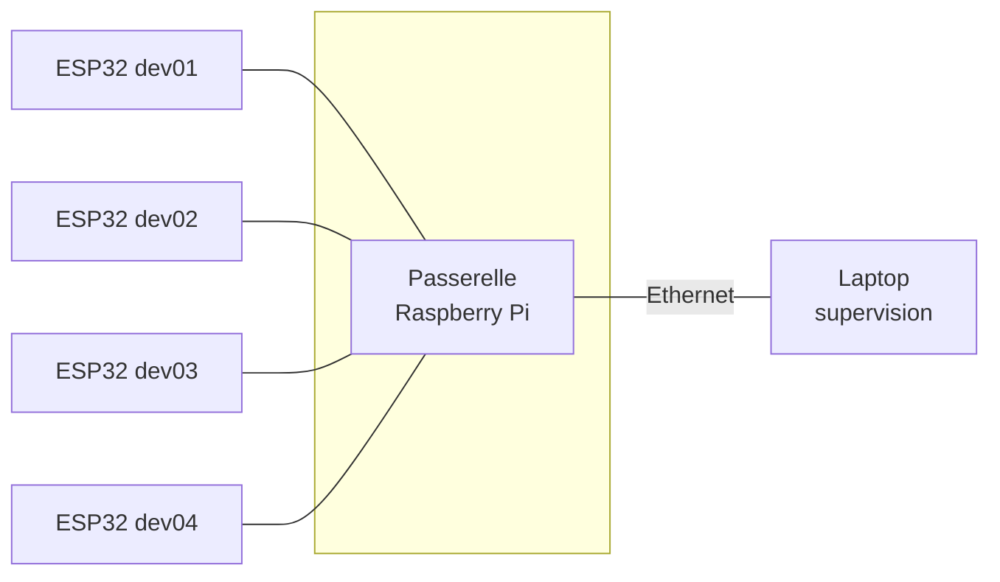

# IoT Systems Deployment & Operations

Ce cours part d'un constat : savoir développer un objet connecté et savoir en
exploiter une flotte sont deux métiers différents. Vous savez faire le premier.
Ces 24 heures portent sur le second.

Vous n'allez pas construire un système. Vous allez en **hériter** d'un, comme
le jour où vous arriverez dans une entreprise : l'infrastructure existe,
personne ne l'a documentée, et votre travail consiste à la comprendre, la
surveiller, la mettre à jour et la réparer quand elle casse.

## Votre îlot

Vous travaillez par groupes de 4 à 5, sur une infrastructure indépendante.



La **passerelle** vous est fournie configurée. Elle porte le point d'accès
Wi-Fi de votre îlot, un serveur DHCP, un broker MQTT de périphérie et un
serveur de fichiers pour les mises à jour firmware.

Le **laptop** est le vôtre, et c'est vous qui le mettez en place. Il héberge
la chaîne de supervision : broker central, base de séries temporelles,
tableaux de bord.

Les **devices** sont quatre ESP32. Ce sont eux que vous provisionnerez,
supervisererez, mettrez à jour et dépannerez tout au long du cours.

## Conventions du support

Partout dans ces pages, **`N` désigne le numéro de votre îlot**. Si vous êtes
sur l'îlot 3, `192.168.N0.1` se lit `192.168.30.1`, et `10.10.N.2` se lit
`10.10.3.2`.

| Îlot | SSID | Réseau des devices | Passerelle | Votre laptop |
|---|---|---|---|---|
| 1 | `ilot-1` | 192.168.10.0/24 | 10.10.1.1 | 10.10.1.2 |
| 2 | `ilot-2` | 192.168.20.0/24 | 10.10.2.1 | 10.10.2.2 |
| 3 | `ilot-3` | 192.168.30.0/24 | 10.10.3.1 | 10.10.3.2 |
| 4 | `ilot-4` | 192.168.40.0/24 | 10.10.4.1 | 10.10.4.2 |
| 5 | `ilot-5` | 192.168.50.0/24 | 10.10.5.1 | 10.10.5.2 |

Chaque chantier se termine par un encart **Vérification** : une commande qui
répond vert ou rouge. Tant qu'elle n'est pas au vert, le chantier n'est pas
terminé, et le suivant ne fonctionnera pas.

Les encarts **Objectif bonus** s'adressent à ceux qui terminent en avance.
Ils sont pris en compte dans l'évaluation continue.

## Ce dont vous avez besoin

Un laptop avec les droits administrateur, Docker Desktop installé, un câble
Ethernet et un adaptateur USB-Ethernet si votre machine n'a pas de port RJ45.

:::warning[À faire avant la première séance]
Le [chantier 0](/chantiers/chantier-0/avant-la-seance) contient des
préparatifs à réaliser chez vous, avec une connexion Internet correcte. La
salle est équipée d'un routeur 4G : si cinq groupes téléchargent un gigaoctet
d'images Docker en même temps, la séance est perdue.
:::

## Si le site est inaccessible

La salle n'a pas d'accès Internet garanti. Chaque passerelle sert une copie
locale de ce support :

```
http://192.168.N0.1:8080/docs
```

Accessible dès que votre laptop ou votre téléphone est connecté au réseau de
l'îlot.
